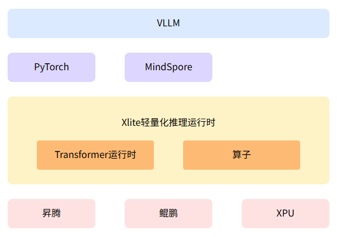

# GVirt

#### 介绍
GVirt是一个轻量级的XPU虚拟化前后端推理运行时。提供极简高效的异构运行环境，支持多样性算力协同。

#### 软件架构

- **Xlite (GVirt前端)**：轻量级Transformer模型运行时，支持多样性算力协同，当前支持在昇腾硬件上高效运行。Xlite公开了Transformer运行所需的模型构图以及算子，所有算子基于昇腾AscendC/CCE开发。目前支持Qwen系列、Llama系列、DeepSeek-R1模型。详见 [Xlite README](xlite/README.md)。。

#### 快速上手
请参考 [Xlite 快速开始](xlite/README.md#快速开始)

#### 编译与构建
请参考 [Xlite 开发指南](xlite/README.md#开发指南)

#### 参与贡献

1.  Fork 本仓库
2.  新建 Feat_xxx 分支
3.  提交代码
4.  新建 Pull Request

#### 目录结构

| 目录 | 说明 |
|------|------|
| xlite | 轻量化推理运行时核心代码（Python） |
| xlite/csrc | 轻量化运行时的核心代码（C++/AscendC） |
| xlite/doc | 相关文档介绍 |
| xlite/docker | 容器镜像Dockerfile |
| xlite/tests | 测试用例 |